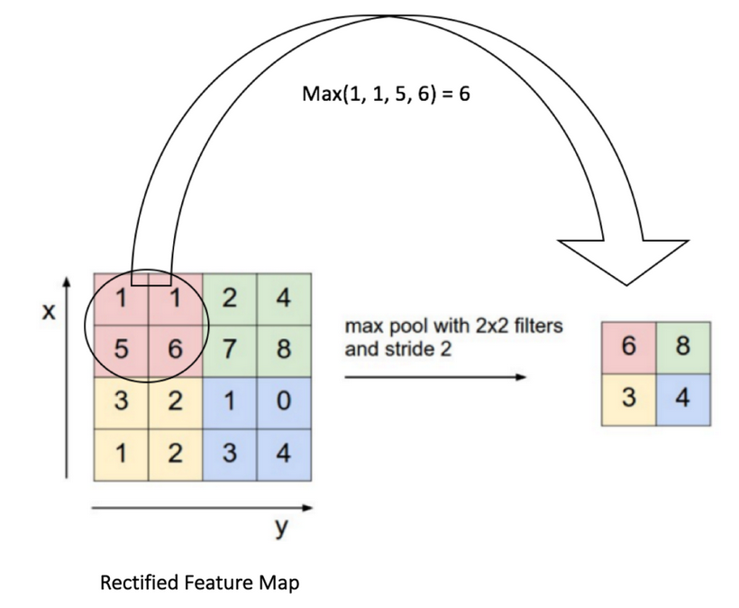

## Session 0: Linear Regression 

See example *session_0.py* and *feed_forward.py*

## Session 1: ConvNet 

#### Major Components 
1. Feature engineering / preprocessing – turn images into something that the algorithm can more efficiently interpret
2. Classification – train algorithm to map images to the given classes and understand the underlying relationship
#### Feature Engineering
##### Convolution

Feature Engineering step in which a filter is applied to the image. 
A kernel (a subset of the image) is passed over the image and the resulting output is a filtered subset of the image. 
Basic matrix multiplication which involves a few parameters described below. 
- Kernel Size - the size of the filter 
- Kernel type - the values of the filter, i.e., identity, edge detection, and sharpen. 
- Stride - The rate at which the kernel moves across the image. A stride of 3 moves the kernel in 4 pixel increments. 
- Padding - can add 0's to the edges of the images such that the kernel passes over all aspects of the image. 
- Output Layers - how many kernels are applied to the image. 

This process is utilized as a 'layer', such that the output of the layer is described as a 'convolved feature' or 'feature map'. 

In short: It is a filtered version of the original image. 

`torch.nn.Conv2d()`

##### ReLU 
We need to take the feature mapping and pass it through a an activation function (i.e., multiplying the feature map by weights and adding a bias). 
Activation function for CNNs are most often variations of ReLU's (Rectified Linear Unit). 
This is because ReLU's convert all negative pixel values to 0, as the output is just Max(0, Input). 
`torch.nn.relu()`

##### Max Pooling 
Last step of feature engineering is the pooling of the output of the relu. 
Passing over sections of the image and pool them based on the highest value in the section. 
Pretty self explanatory, and an image (from [Stanford](https://cs231n.github.io/convolutional-networks/ "Course Page")) is provided below 
NOTE: Rectified Feature map is the output from the ReLU layer after the convolution. 
`torch.nn.MaxPool2d()`

#### Fully Connected Layer
 
After the image is passed through the block above (Conv -> ReLU -> Max Pooling) we pass the result into a 'traditional' ANN architecture. 

  