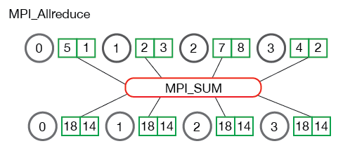

## Session 2: Efficient Data Loading using DALI 
Resources: 
- [DALI Repository](https://github.com/NVIDIA/DALI)
- [Dali Pytorch](https://github.com/yaysummeriscoming/DALI_pytorch_demo)
##### Install 
CUDA 10

    pip install --extra-index-url https://developer.download.nvidia.com/compute/redist nvidia-dali-cuda100

CUDA 11

    pip install --extra-index-url https://developer.download.nvidia.com/compute/redist nvidia-dali-cuda110
    
DALI is an accelerated data pipeline for computer vision in deep learning applications. 
#### General Overview 
- Utilizing GPU for the offloading of dataloading operations. 
Typically the CPU is used for preprocessing tasks due to the simplicity of OpenCV or Pillow (python libraries for image importing). 
DALI instead gives the overview as seen below [(Source)](https://developer.nvidia.com/blog/fast-ai-data-preprocessing-with-nvidia-dali/)

The data pre-processing tasks are done in 'pipelines' which are outlined below. 

##### Pipelines 

Within a pipeline (dataflow graph), a node can be represented as a data processing **Operator**.
There are three types of **Operators** 

- CPU: Accepts and produces data on CPU 
- Mixed: Accepts data from CPU and produces output on the GPU side
- GPU: accepts and produces data on the GPU 

The figure below shows an example pipeline. 

Another feature of DALI is the fetching of data transparently alongside the training. 
Normally one gathers all of the data used for training at once, but this once again puts a lot of labor on the CPU (bottlenecks). 
An example of DALI's batching is shown below. 

##### Usage 

DALI has a API for python, which is the `Pipeline` class. Below is an example pipeline. 

    class SimplePipeline(Pipeline):
       def __init__(self, batch_size, num_threads, device_id):
           super(SimplePipeline, self).__init__(batch_size, num_threads, device_id, seed = 12)
           self.input = ops.FileReader(file_root = image_dir, random_shuffle = True)
           self.decode = ops.HostDecoder(output_type = types.RGB)
           self.rotate = ops.Rotate()
           self.rng = ops.Uniform(range = (-10.0, 10.0))
       def define_graph(self):
           jpegs, labels = self.input()
           images = self.decode(jpegs)
           angle = self.rng()
           rotated_images = self.rotate(images, angle = angle)
           return (rotated_images, labels)

In principle there are just two methods needed: 
- __init__: the choice of operators and additional parameters
    - Operators: importing of data and any data augmenters
        - FileReader(file_root): reads files from the drive 
        - HostDecoder(output_type): decodes images into desired format. 
        - Rotate() + Uniform(range): Rotating the images across a uniform range of angles 
        - etc.
            - one can offload any of these operations onto the GPU by simply using the parameter `self.rotate = ops.Rotate(device='gpu')`  
    - super parameters:
        - batch_size: Pipeline also handles batching of data 
        - num_threads: number of worker threads to use 
        - device_id: ID of GPU device 
        - seed: random seed for shuffling 
          
- define_graph:
    - connecting the forward passing of data within the processing steps. 
        - here we take the images and labels from the FileReader then decode the images and return both images and labels as the output of the Pipeline.
Then when everything is defined, we use the following code to run: 

    pipe = SimplePipeline(batch_size, 1, 0)
    pipe.build()
    images, labels = pipe.run()      

##### Frameworks integration 
To introduce this into a Pytorch model, just wrap into `DALIClassificationIterator`, i.e., 

    train_loader = DALIClassificationIterator(pipe, size=int(pipe.epoch_size("Reader")))
    for i, data in enumerate(train_loader):
        images = data[0]["data"]
        labels = data[0]["label"].squeeze().cuda().long()
        # model training

## Session 3: Mixed Precision Training using Apex 
Resources: 
- [Apex Repository](https://github.com/NVIDIA/apex)
- [Example in Scientific Computing](https://developer.nvidia.com/blog/tensor-cores-mixed-precision-scientific-computing/)
##### Install 

    $ git clone https://github.com/NVIDIA/apex
    $ cd apex
    $ pip install -v --no-cache-dir --global-option="--cpp_ext" --global-option="--cuda_ext" ./

#### General Overview 
Improve speed and memory use without changing architecture. 
Mixed precision is training of a mixture of precision of byte floating point 16 and floating point 32.
FP32 is 32bit float, where as FP16 is 16bit half, half precision. 32 bit being more precise, however FP16 is smaller and thus more memory efficient, allowing for faster computation.
Pytorch already as FP16 support through the uses of `my_tensor.half()` through native operations (and NVIDA). 
APEX does this casting automatically in addition to other stability enhancements. 
Using APEX is very powerful on NVIDIA GPUs. 
Instead of doing everything in FP16 or FP32, there are tangible benefits of mixed precision training. 

##### Weight Updates 
In FP16, if the update param is less than 2E-11, the update has no effect, i.e., 1+0.001 = 1 

    param = torch.cuda.HalfTensor([1.0])
    update = torch.cuda.Halftensor([0.001])
    # param + update = 1
However with FP32, 1 + 0.001 = 1.0001, i.e., 

    param = torch.cuda.FloatTensor([1.0])
    update = torch.cuda.FloatTensor([0.0001])
    # param + update = 1.0001    
##### Internal Operations (Batchnorm, softmax, logarithm, exponentiation)
In FP16, certain operations can overflow, as seen below. 

    a = torch.cuda.HalfTensor(4096)
    a.fill_(16.0) 
    a.sum()
    # a = inf 

Whereas in FP32, we don't get the overflow and the sum is captured

    b = torch.cuda.FloatTensor(4096)
    b.fill_(16.0) 
    b.sum()
    # b = 65504 
     
##### Small gradients 
When gradients are small in magnitude, using FP16 results in underflowing, i.e., reducing to 0. 
Apex chooses to use a trick of chain rule by scaling the loss by some constant C, such that when the derivative is taken via chain rule, the resulting gradient is also scaled by C. 
Always remember to unscale by factor of 1 / C! This is beneficial to preserve the use of FP16, i.e., maintaining speed and memory usage by use of simple scaling. 

##### Recipe 
Weight updates -> FP32 
Precise Operations (log, exponential, batchnorm) -> FP32 
Gradients -> Scale loss as FP16

These are all implemented under the hood by APEX. 
In the simple example in `DALI_example.py` we see the changes with just a few lines of code. 
Those lines are reproduced below. 

FP32 vs FP16 optimization

    model, optimizer = amp.initialize(model, optimizer, opt_level='O1')
    
Scaled Loss: 

        with amp.scale_loss(loss, optimizer) as scaled_loss:
        scaled_loss.backward()

APEX determines whether to use FP16 or FP32 under the hood or using inputs into the initialize function. See documentation for more details. 
Can also change the optimization levels `opt_level` with different defaults. Note each level is represented by the letter 'O' as in Octopus, followed by a digit.  
- O0
    - Pure FP32 Training 
- O1  
    - Conservative Mixed Precision: Patches Torch functions to internally carry out Tensor Fore friendly operations in FP16, and operations that benefit from additional precision in FP32. 
- O2 
    - Fast Mixed Precision: FP16 Model and Data with FP32 batchnorm and master weights with dynamic loss scaling 
- O3 
    - Pure FP16 training i.e., 'speed of light' for model 
    
Each of these opt_levels changes the set of properties listed below: 

- cast_model_type (torch.dtype)
    - cast model params and buffers to the desired type 
- patch_torch_functions (boolean) 
    - Patch all Torch functions to preform all friendly ops in FP16, and any ops that benefit from FP32 as FP32 
- cast_batchnorm (torch.dtype)
    - maintains batchnorms as the desired type 
- master weights (bool)
    - Use FP32 Master weights    
- loss_scale (float, or 'dynamic')
    - if float value, use this values as the static loss scale. Dynamic adaptively adjust the loss scale over time. 

These changes are done in the initialize function. 

## Session 4: Multi-GPU Training using Horovod 
Resources: 
- [Horovod Repository (includes Installation)](https://github.com/horovod/horovod)
- [Horovod with Pytorch](https://github.com/horovod/horovod/blob/master/docs/pytorch.rst)

#### General Overview 
Take single-GPU training script and scale it to train across many GPUs in parallel.
Horovod used MPI Allreduce, AllGather, and boadcast. 

##### MPI_Allreduce 
Reducing data sizes with a specific reduction operation like Max, Min, Sum, etc., i.e., `[1,2,3,4,5,6,7] -> sum([1,2,3,4,5,6,7]) = 120`

 
##### MPI_Allgather 
Uses sparse tensors to distribute processes in gathering data all at once on every process. 

The elements from each process are gathered in order of their rank, except this time the elements are gathered to all processes

##### Broadcast 
Broadcasting data from one process identified by root rank onto every other process. 

 

In this example, process zero is the root process, and it has the initial copy of data. All of the other processes receive the copy of data
All pictures are from  [(Source)](https://mpitutorial.com/tutorials/mpi-scatter-gather-and-allgather/):
One can implement these via initializing the horovod tool at the beginning of model compilation, and designating which processes (optimizer, loss, gradient calculation) to use MPI scattering. 

