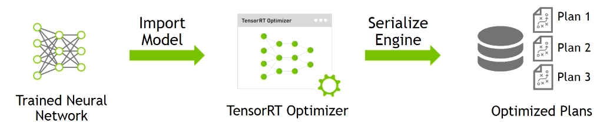
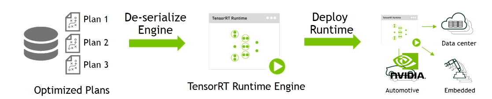

#Deploying Models with TensorRT

### Resources 
- [Homepage](https://developer.nvidia.com/tensorrt)
- [Github / Installation](https://github.com/NVIDIA/TensorRT)
- [PythonAPI](https://docs.nvidia.com/deeplearning/tensorrt/developer-guide/index.html#python_topics)

## General Overview

TensorRT deploys deep learning apps onto a GPU to increase throughput and reduce latency during predictions. 

Import models trained using popular ML packages or use Network definition API. 

Optimize frequently used layers and integrate user defined custom layers.
#### Current Deployment Workflow 

Training Workflow (using Pytorch, TensorFlow)
- Gather Training Data
- Data Management, Training, Model Assessment (Repeat Until)
- Trained ANN 

Unoptimized Deployment (Choose One)
1. Deploy training network 
2. Deploy custom application using NVIDIA DL SDK  (cuDNN, cuBLAS, NCCL)
3. Framework or custom CPU-only Application

#### Current Challenges 
| **Requirement** | **Challenges** | 
| :-------------- | ------------: |
| High Throughput | Unable to process high-volume/-velocity data leads to high cost per prediction |
| Low Response Time | Real-Time results are not delivered | 
| Power and Memory Efficiency | Increased cost (running & cooling) makes deployment infeasible |
| Deployment-Grade Solution | Research Frameworks are normally not designed for production | 

#### TensorRT Deployment Workflow

TensorRT takes the trained network, and optimizes it for production uses. NOTE: Seems nice if we were to have some network like PPPL had. 

##### Step 1: Optimize trained model 

Prepare the optimized model
- Model Importing
    - Can support built-in layer and also custom layer API 
- TensorRT Optimizations 
    - Layer & Tensor Fusion 
        - Graph Optimizations i.e., layers that are the same structurally are executed at the same time
        - Autocompletes concat i.e., fewer kernel launches
        - Layer reduction (not changing graph just changing the way graph is executed)
    - Weights & Activation Precision Calibration
        - See mixed precision from APEX in Week 2
    - Kernel Auto-Tuning 
        - Kernels are prepared / GPU for specific GPU with specific parameters, 
    - Dynamic Tensor Memory
        - reduces memory footprint and improves memory re-use 
        - manages memory allocation for each tensor only for duration of its usage
    
##### Step 2: Deploy optimized ps with runtime 

Code Example 

    # TensorRT Modules
    import tensorrt as trt
    import uff 
    from tensorrt.parsers import uffparser
     
- Start with frozen model

    # Load newly created TF model and convert to UFF
    uff_model = uff.from_tensorflow_frozen_model('frozen_model_file.pb', OUTPUT_LAYERS)
    # example of 'output_layer' -> 'dense_2/Softmax'
    
     
- Create model parser and register inputand outputs

     # Create UFF parser to parse TF frozen model 
    parser = uffparser.create_uff_parser()
    parser.register_input('input_1', (input_shape), 0)
    parser.register_output('output_layer')     
    # input_shape -> (input_c, input_h, input_w)
- optimize model and create run-time engine 

    # Build TensorRT inference engine 
    # This step preforms 1. Tensor fusions 2. Reduced precision 3. Target Autotuning 4. tensor memory management 
    engine = trt.utils.uff_to_trt_engine(G_LOGGER, uff_model, parser, 1, 1<<20, trt.infer.DataType.Float)
    # G_LOGGER is a logging util, specified before by 
    # G_logger = trt.infer.ConsoleLogger(trt.infer.LogSeverity.INFO)
    # 1<<20 is workspace requirement
    
- serialize engine for deployment 

    
    trt.utils.write_engine_to_file('model_name.engine', engi.serialize())
         
- deserialize engine
    
    
    engine = Engine(PLAN=plan, postprocessors={'output_layer_name':post_processing_functions})
- preform predictions 
    
    
    result = engine_single.infer(image)    
### Sample Network
How to create a simple network with Input, Convolution, Pooling, FullyConnected, Activation and Softmax Layers

    # Create the builder and network
    with trt.Builder(TRT_LOGGER) as builder, builder.create_network() as network:
        # Configure the network layers based on the weights provided. In this case, the weights are imported from a pytorch model. 
        # Add an input layer. The name is a string, dtype is a TensorRT dtype, and the shape can be provided as either a list or tuple.
        input_tensor = network.add_input(name=INPUT_NAME, dtype=trt.float32, shape=INPUT_SHAPE)
    
        # Add a convolution layer
        conv1_w = weights['conv1.weight'].numpy()
        conv1_b = weights['conv1.bias'].numpy()
        conv1 = network.add_convolution(input=input_tensor, num_output_maps=20, kernel_shape=(5, 5), kernel=conv1_w, bias=conv1_b)
        conv1.stride = (1, 1)
    
        pool1 = network.add_pooling(input=conv1.get_output(0), type=trt.PoolingType.MAX, window_size=(2, 2))
        pool1.stride = (2, 2)
        conv2_w = weights['conv2.weight'].numpy()
        conv2_b = weights['conv2.bias'].numpy()
        conv2 = network.add_convolution(pool1.get_output(0), 50, (5, 5), conv2_w, conv2_b)
        conv2.stride = (1, 1)
    
        pool2 = network.add_pooling(conv2.get_output(0), trt.PoolingType.MAX, (2, 2))
        pool2.stride = (2, 2)
    
        fc1_w = weights['fc1.weight'].numpy()
        fc1_b = weights['fc1.bias'].numpy()
        fc1 = network.add_fully_connected(input=pool2.get_output(0), num_outputs=500, kernel=fc1_w, bias=fc1_b)
    
        relu1 = network.add_activation(fc1.get_output(0), trt.ActivationType.RELU)
    
        fc2_w = weights['fc2.weight'].numpy()
        fc2_b = weights['fc2.bias'].numpy()
        fc2 = network.add_fully_connected(relu1.get_output(0), OUTPUT_SIZE, fc2_w, fc2_b)
    
        fc2.get_output(0).name =OUTPUT_NAME
        network.mark_output(fc2.get_output(0))
    
# Profiling with NVTX 
