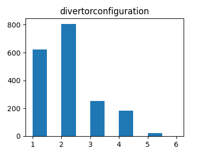
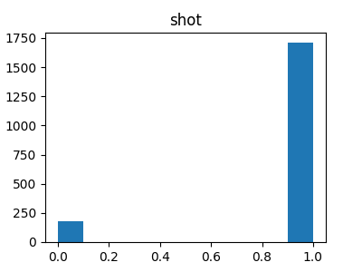

# Structure of Filtered JET Pedestal Dataset

The filtering done on the pedestal database is described here. 

First, the file in question is the most recent pedestal database that has comma separated values, and can be found LINK. 
Using a python script, we then convert the entire dataset into a pandas dataframe. More about pandas can be read HERE. 
#### Filter Impurities
Next we filter the following impurities: 

- RMP's 
- Seeding 
- Kicks 
- Pellets

So any shot that contains any of the above flags, is filtered out.

#### Specific Filtering
Some specific filtering has taken place which is described below: 
- Zeff < 6
- pressure pedestal width > 0 

#### Quantify Divertor and Wall type
Then, we need to quantize the divertor configuration, as well as the wall type. 
The divertor configuration has the following syntax (written in python dict format): 

{'CC': 1, 'VH': 2, 'VC': 3, 'VV': 4, 'CV': 5, 'CH': 6}

and all JET-C wall types have a value of 0, while the JET-ILW shots have values of 1.0. 

#### Results 

At the end we are left with **1888 entries**. 

The final distribution of data is as follows: 

 

We can see that there is very little shots with the CV, and CH configuration, and mostly we have shots with the VH and CC configuration. 

Most of the shots are coming from the ILW, while less than 200 are from the carbon wall. 

This is important to note, as we predict that the ML/NN tools will have a harder time predicting those shots with less data values. 

# Dataloading 
Use the built in tools of pytorch [here](https://pytorch.org/docs/stable/_modules/torch/utils/data/dataloader.html). Basically we create a python class that when called delivers the inputs and targets to the NN wrapped in a tensor.
Pretty neat. 
## Accurately sampling 

In order to train the NN/ML models, we need to somewhat 'evenly' sample the dataset into training and validation subsets.
We would like the training and validation subsets to resemble what the histograms above look like.
Using pytorch's [random sampler](https://pytorch.org/docs/stable/_modules/torch/utils/data/sampler.html), we can represent a similar distribution of DC (and all other parameters) between the training and validation subsets. 
This can be verified using the methods found in `data_filtering.py`

